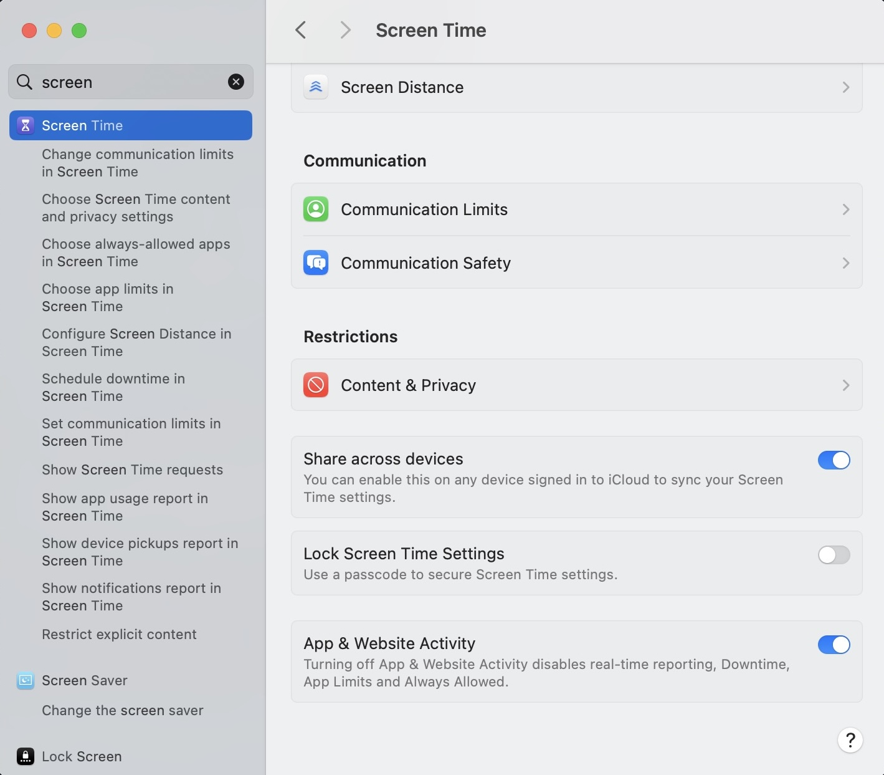

## Introduction

Have you ever thought about where your time has gone to? I have. While tracking down where every minute of my life went to in a journal seems a little extreme, we have the power of technology!

I use an iPhone and a MacBook (Not sponsored but wouldn't mind one ;-) ), and they have this function called Screen Time.

## Motivation

I chanced upon [Felix's article](https://felixkohlhas.com/projects/screentime/), and thought it would be quite interesting to study where my time went ~~and expose my poor time management to the world~~.

## Tools & Technologies

Instead of InfluxDB like Felix, I used **Supabase** as the backend database to store and query my screen time data, with **Python** handling the data processing.

## Data Collection Process

Firstly, you need to sync the screen time across devices. This can be done via the settings.

I then referenced Felix's code to extract the screen time data via my Macbook. Did some **Python** and **SQL** magic to automate the storing of data straight into Supabase.

<!--
## Data Analysis Approach

An overview of the methods and Python scripts used to analyze the collected data. -->

## Results & Insights

Super excited to see the time series graph for this! I'll check back in when I have enough data to show, but credits to the original author for writing the code!

<!-- ## Future Work

Plans for further analysis and improvements as more data becomes available. -->

### References

- [Original Article by Felix Kohlhas](https://felixkohlhas.com/projects/screentime/)
